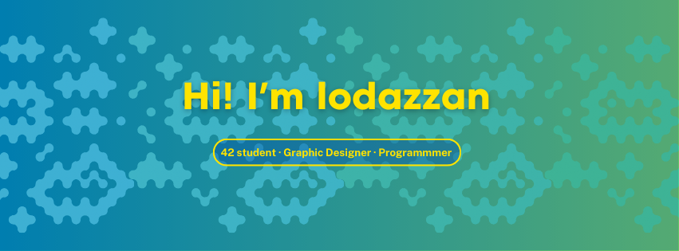

  

## About me 💡

Hello there! My name is Lorena, but everybody calls me Cele. I am a creative mind with a keyboard and a dream!

I have experience working in the videogame industry, as well as a Graphic Design degree. Recently I decided to mix both and start coding.

To pursue this new path, I am currently studying in 42 Málaga to develop my coding skills as well as my soft skills.

If you want to see how it goes, you can check my progress here or follow me on Linkedin!

  
  <h3 style="margin: 0;">Skills I Am Working On</h3>
  

## 42 Projects Shortcuts

## 42 Profile

